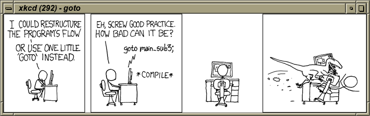

# fortran-xkcd
An *fpm* example project written in Fortran 2008 that displays the latest
[xkcd](https://xkcd.com/) comic inside an X window. As a limitation, only images
in PNG format are supported (no JPEG). The alt text will be printed to console.

The program depends on X11, libcairo, libcurl, as well as the following Fortran
libraries:

* [fortran-curl](https://github.com/interkosmos/fortran-curl)
* [fortran-xlib](https://github.com/interkosmos/fortran-xlib)
* [json-fortran](https://github.com/jacobwilliams/json-fortran)

You can pass the xkcd number to view a specific comic strip:
```
$ ./xkcd 292
```

## Screen Shot


## Build Instruction
Just clone the repository and build the executable with *fpm*:
```
$ git clone https://github.com/interkosmos/fortran-xkcd
$ cd fortran-xkcd/
$ fpm build --profile release
$ fpm run
```
The binary `xkcd` will we written to `build/<compiler>/app/`.

## Licence
ISC
